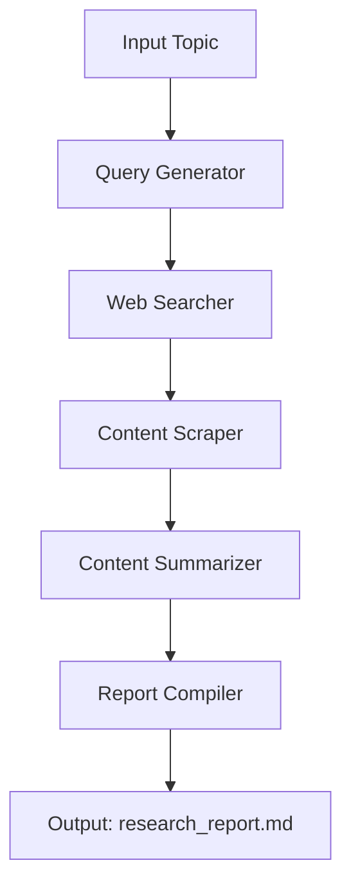

# AI Research Assistant

## Quickstart

1. **Clone and enter the repo:**
   ```bash
   git clone <repository-url>
   cd <repository-directory>
   ```
2. **Create and activate a virtual environment:**
   ```bash
   python -m venv research_agent_env
   # Windows:
   research_agent_env\Scripts\activate
   # macOS/Linux:
   source research_agent_env/bin/activate
   ```
3. **Install dependencies:**
   ```bash
   pip install -r requirements.txt
   ```
4. **Add your API keys to `.env` (see below).**
5. **Run the agent:**
   ```bash
   python research_graph.py
   ```
   or launch the UI:
   ```bash
   python gui/main.py
   ```

---

## Project Overview

The **AI Research Assistant** is an automated research agent built with [LangChain](https://python.langchain.com/) and [LangGraph](https://github.com/langchain-ai/langgraph). It takes a research topic, generates search queries, gathers and scrapes web content, summarizes findings, and compiles a structured report.

**Workflow Diagram:**

```mermaid
flowchart TD
    A[Input Topic] --> B[Query Generator]
    B --> C[Web Searcher]
    C --> D[Content Scraper]
    D --> E[Content Summarizer]
    E --> F[Report Compiler]
    F --> G[Output: research_report.md]
```

**Key Features:**
- **Automated Research Pipeline:** Topic → Queries → Web Search → Scraping → Summarization → Report.
- **Stateful Graph Architecture:** Each step is a node in a LangGraph workflow, passing state via a `ResearchState` object.
- **Persistence:** Supports checkpointing with SQLite for workflow recovery.
- **Comprehensive Testing:** Each node and workflow component has dedicated unit tests.
- **Modern Graphical UI:** KivyMD-based interface for interactive research and markdown report viewing.

---

## How It Works

1. **Input a research topic** (via CLI or UI).
2. The agent generates relevant search queries.
3. It performs web searches and scrapes content.
4. Summarizes findings using LLMs.
5. Compiles a structured markdown report (`research_report.md`).

---

**Code Structure:**
- [`research_graph.py`](research_graph.py:1): Core logic, state definition, node functions, and graph assembly.
- [`workflow_builder.py`](workflow_builder.py:1): Workflow construction and configuration.
- [`agent_runner.py`](agent_runner.py:1): High-level runner for executing the agent and saving reports.
- [`test/`](test/): Unit tests for all components.
- [`requirements.txt`](requirements.txt:1): Dependency list.
- [`.env`](.env): API keys and environment variables.

**APIs & Libraries Used:**
- **LangChain**: LLM orchestration and prompt management.
- **LangGraph**: Graph-based workflow execution.
- **Google Gemini**: LLM for query generation and summarization.
- **Tavily**: Web search API.
- **BeautifulSoup**: HTML parsing and scraping.
- **Requests**: HTTP requests for web scraping.
- **Pytest**: Unit testing framework.

For a step-by-step build guide, see [`Guide.md`](Guide.md:1).
For development plans and progress, see [`ImplementationPlan.md`](ImplementationPlan.md:1).

---

## Getting Started

Follow these steps to set up and run the AI Research Assistant locally:

### Prerequisites
1. **Python**: Ensure Python 3.8 or newer is installed.
2. **IDE**: Visual Studio Code is recommended.
3. **Internet Access**: Required for research tools and API access.

### Setup Instructions
1. **Clone the Repository**:
   ```bash
   git clone <repository-url>
   cd <repository-directory>
   ```

2. **Create a Virtual Environment**:
   ```bash
   python -m venv research_agent_env
   ```

3. **Activate the Virtual Environment**:
    - **Windows**:
        ```bash
        research_agent_env\Scripts\activate
        ```
    - **macOS/Linux**:
        ```bash
        source research_agent_env/bin/activate
        ```

4. **Install Dependencies**:
   ```bash
   pip install -r requirements.txt
   ```

5. **Set Up API Keys**:
   - Open the `.env` file and add your API keys:
     ```
     OPENAI_API_KEY=your_openai_api_key_here
     GOOGLE_GEMINI_API_KEY=your_google_gemini_api_key_here
     TAVILY_API_KEY=your_tavily_api_key_here
     LANGCHAIN_TRACING_KEY=your_langchain_tracing_key_here
     ```
   - See [API provider docs](https://platform.openai.com/account/api-keys), [Google Gemini](https://aistudio.google.com/app/apikey), [Tavily](https://app.tavily.com/keys), or your organization for how to obtain keys.
   - **Never commit your `.env` file or API keys to version control.**

### Running the Application
1. **Run the Script**:
   ```bash
   python research_graph.py
   ```

2. **Provide a Research Topic**:
   - The application will prompt you to enter a topic for research.

3. **View the Output**:
   - The final research report will be saved as `research_report.md`.

### Running the AI Agent

You can run the AI Research Assistant programmatically with a provided topic string using [`agent_runner.py`](agent_runner.py:1). This allows you to automate research tasks without manual input.

**Example usage:**
```python
from agent_runner import run_agent

# Replace with your desired research topic
topic = "Recent advances in quantum computing"
final_state = run_agent(topic)

# The final report will be saved as 'research_report.md'
print("Research complete. Report saved.")
```

- The `run_agent` function handles the full workflow: query generation, web search, scraping, summarization, and report compilation.
- Ensure your `.env` file is configured with valid API keys before running the agent.

---

### Running the Graphical User Interface (UI)

A modern graphical UI is provided for interactive research and markdown report viewing.

**Prerequisites:**
- Python 3.8 or newer
- [KivyMD](https://kivymd.readthedocs.io/en/latest/) and [Kivy](https://kivy.org/#download) (`pip install kivy kivymd`)
- (Optional) [plyer](https://github.com/kivy/plyer) for file dialogs (`pip install plyer`)

**To launch the UI:**
```bash
python gui/main.py
```

**Features:**
- Enter a research topic and run the agent with a button click
- View live status updates and markdown output in real time
- Save or load markdown reports via file dialogs (requires plyer)
- Responsive, modern layout with dynamic background

**Troubleshooting:**
- If you see errors about missing Kivy/KivyMD, install them with `pip install kivy kivymd`
- For file open/save dialogs, install plyer (`pip install plyer`). On some platforms, file dialogs may not be supported.

See [`gui/main.py`](gui/main.py:1) for implementation details.
### Running Unit Tests
To ensure the integrity and correctness of the codebase, run the unit tests using `pytest`.

- **To run all tests:**
  ```bash
  pytest
  ```

- **To run a specific test file:**
  ```bash
  pytest test/test_file_name.py
  ```
  (Replace `test_file_name.py` with the actual name of the test file)

### Notes
- Ensure all API keys are valid and have the necessary permissions.
- For debugging and tracing, consider setting up LangSmith.
- For more detailed instructions, see [`Guide.md`](Guide.md:1).

---

## FAQ / Troubleshooting

**Q: The UI won't launch or I get Kivy errors.**
A: Make sure you have installed both `kivy` and `kivymd` (`pip install kivy kivymd`). For file dialogs, install `plyer`.

**Q: I get an error about missing API keys.**
A: Double-check your `.env` file is present and filled out as shown above.

**Q: Where is the output saved?**
A: The research report is saved as `research_report.md` in the project root.

**Q: Can I use my own LLM or search provider?**
A: Yes, but you will need to modify the relevant node in [`research_graph.py`](research_graph.py:1) and update dependencies.

**Q: How do I run tests?**
A: See the "Running Unit Tests" section above.

---

## Contributing

Contributions are welcome! To get started:
- Read [`ImplementationPlan.md`](ImplementationPlan.md:1) and [`Guide.md`](Guide.md:1).
- Fork the repo and create a feature branch.
- Ensure all new code is covered by unit tests.
- Open a pull request with a clear description of your changes.

---

## License

This project is licensed under the MIT License.